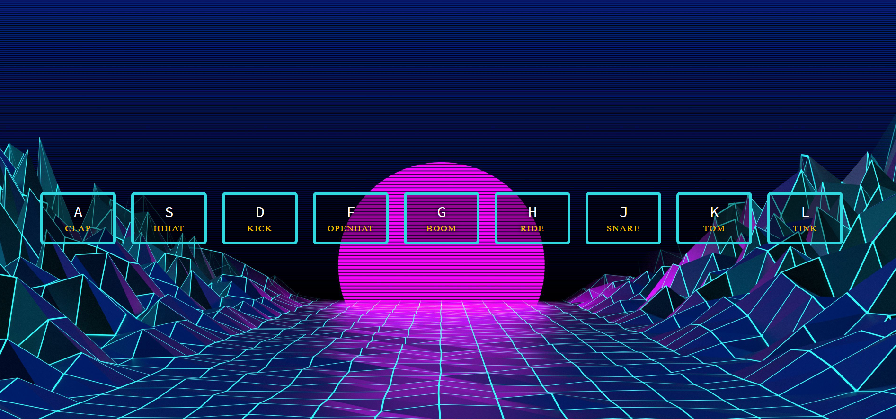

## A note on Pull Requests

These are meant to be 1:1 copies of what is done in the video. If you found a better / different way to do things, great, but I will be keeping them the same as the videos.

The starter files + solutions will be updated if/when the videos are updated.

Thanks!

